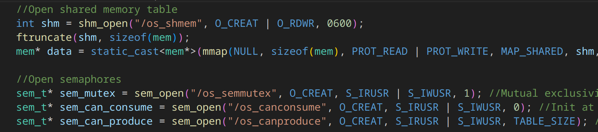
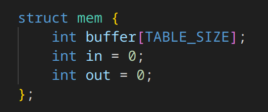
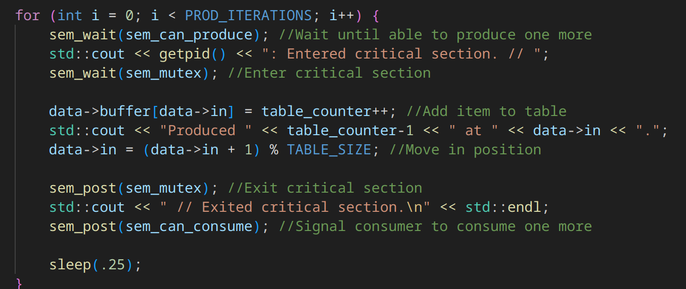
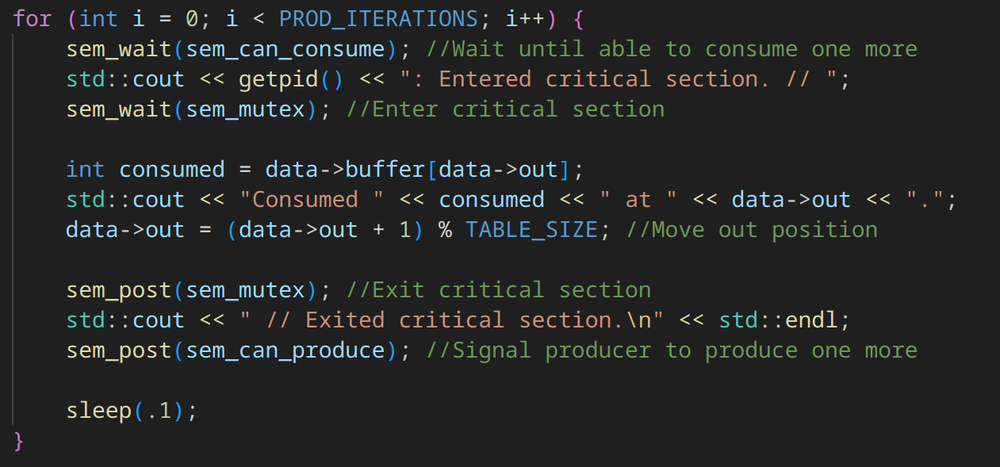
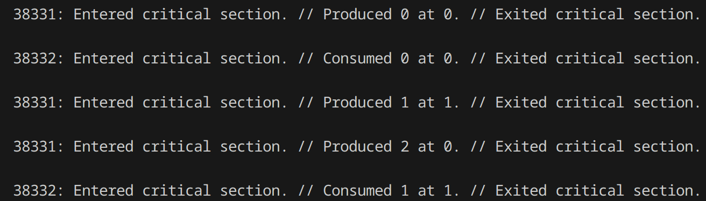

# Producer Cosnumer Problem
This program utilizes semaphores and mutual exclusive access to shared data to create a shared memory buffer containing data. The program is made up of two parts: a producer and a consumer. The producer adds data onto the buffer, while the consumer takes the data from the buffer (without necessairly overwriting it), and displays it out, signaling the producer that it may overwrite the value.

## Usage
Compile on a Linux/UNIX machine using g++:
- ``g++ producer.cpp -pthread -lrt -o producer``
- ``g++ consumer.cpp -pthread -lrt -o consumer``

Run the program using ``./producer & ./consumer &``

If for some reason execution of the program ends prematurely, ``cleanup`` can be used to refresh the shared memory and semaphores.

Compile and run it using
- ``g++ cleanup.cpp -pthread -lrt -o cleanup``
- ``./cleanup``

## Explanation of key components

First, in each producer and consumer, they are linked to the named shared memory tables and semaphores. They will be created if they do not exist.

There are three semaphores, two for signaling when the producer shall produce and the consumer shall consume, and one for mutually exclusive access (we do not want two producers to produce at the same time, for instance).

A shared memory table is created containing the following struct:

With ``in`` and ``out`` containing the respective starting and ending positions of the producer and consumer respectively, and ``buffer`` containing the actual data.

Producer:

Consumer:

The producer and consumer follow a very similar logic. While either can consume or porduce one more, they shall, given the opportunity, produce or consume. Their respective positions inside the buffer will be updated, and they will signal their respective semaphores, signaling whether the producer can consume one more, or the consumer can consume one more.

The ``sem_can_consume`` semaphore starts at 0, because when the program is initailized, there are no elements in the buffer. Once elements are added, ``sem_can_consume`` is signaled by the producer, which unblocks the consumer program and proceeds to consume. It also signals the producer ``sem_can_produce``, since each element producer produces decrements the ``sem_can_produce`` semaphore by one. ``sem_can_produce`` is initialized with a value of the size of the table (in this case, is 2, meaning the producer can produce 2 more elements before needing to wait for the consumer to signal).

Note how while writing or reading data from the shared memory buffer, semaphore ``sem_mutex`` is used. This is to ensure mutual exclusive access to the shared memory. No more than one process may read or write from the shared memory at a given time.

## Expected ouptut

The processes are distinguished by their PID. The example code produces and consumes up to 20 interations, though the value can be increased if you wish.

